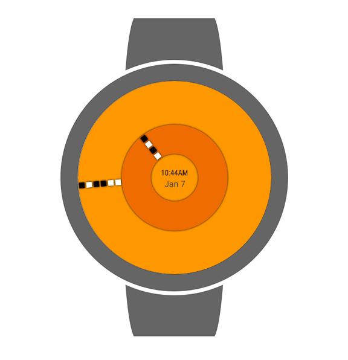
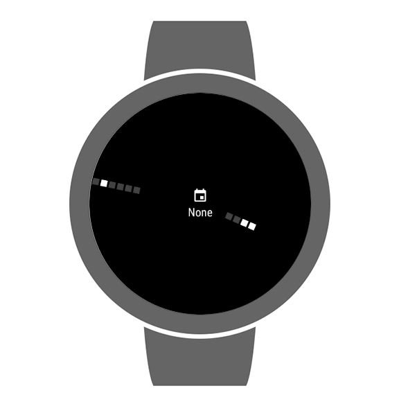
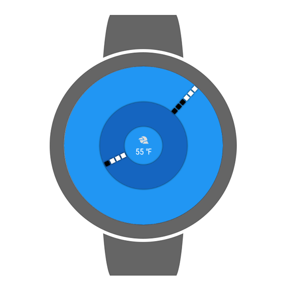

# Binary Analog Watch Face

An analog watch face with a binary twist, set in a material design

Inspired by [Anthony Liekens's](http://anthony.liekens.net/) [Analog Binary Wall Clock](http://anthony.liekens.net/static/analogbinaryclock.html)

## Features

 * Material color themes
 * Customizable center complication
 * Watch face hands are made of binary digits representing current time
 * Minimal design
 * Open Source

## [Screenshots](Screenshots/)

